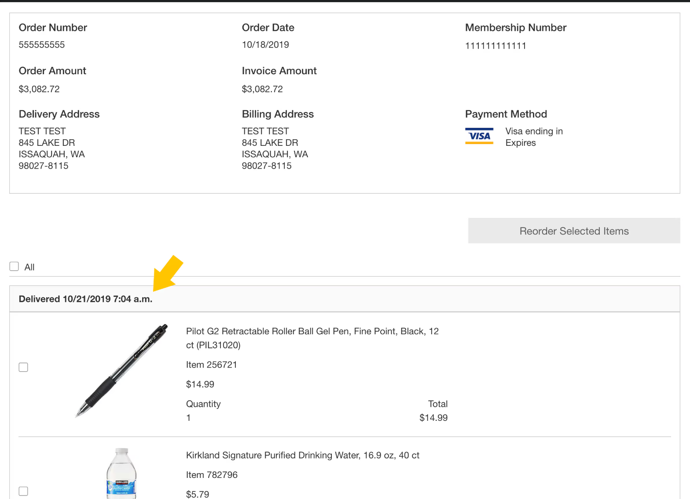
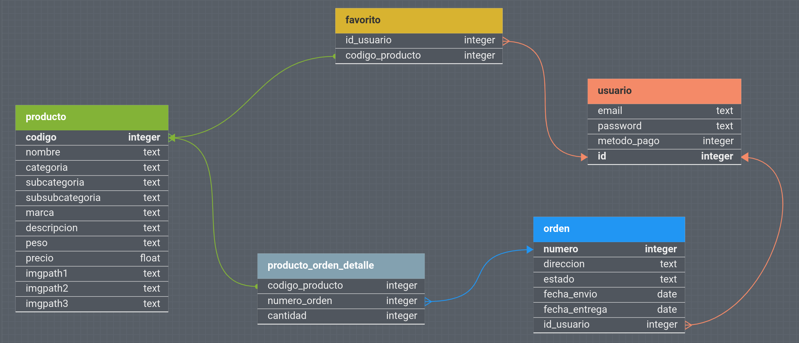

# Costco

## Paginas

### Ordenes
                                                                                    


## Para construirlo

- Correr:

```
mvn package 
java -jar ./target/Costco-1.0.jar
```

- Intellij o Netbeans y ejecutar clase Main

## Requisitos

- Pedidos
- Stock debe de reducirse al comprar

## BD


